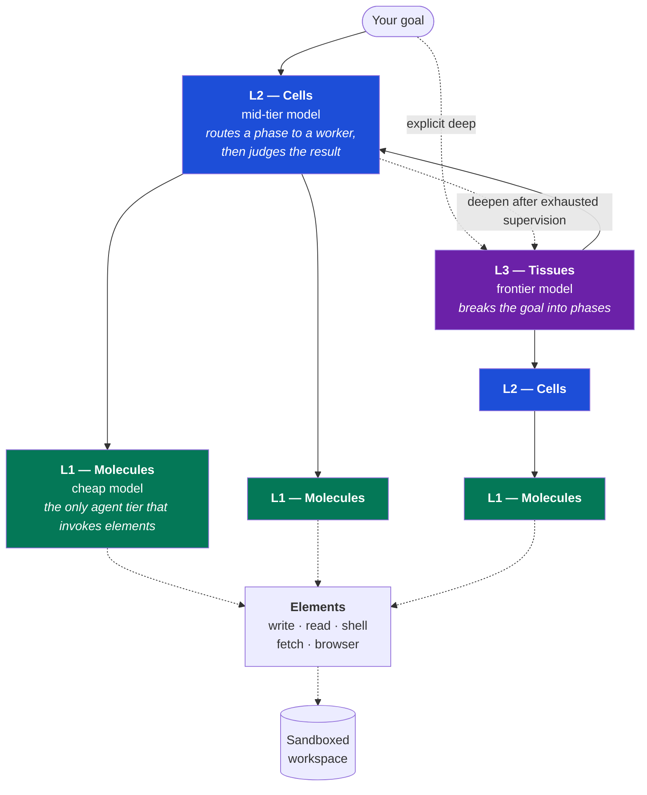
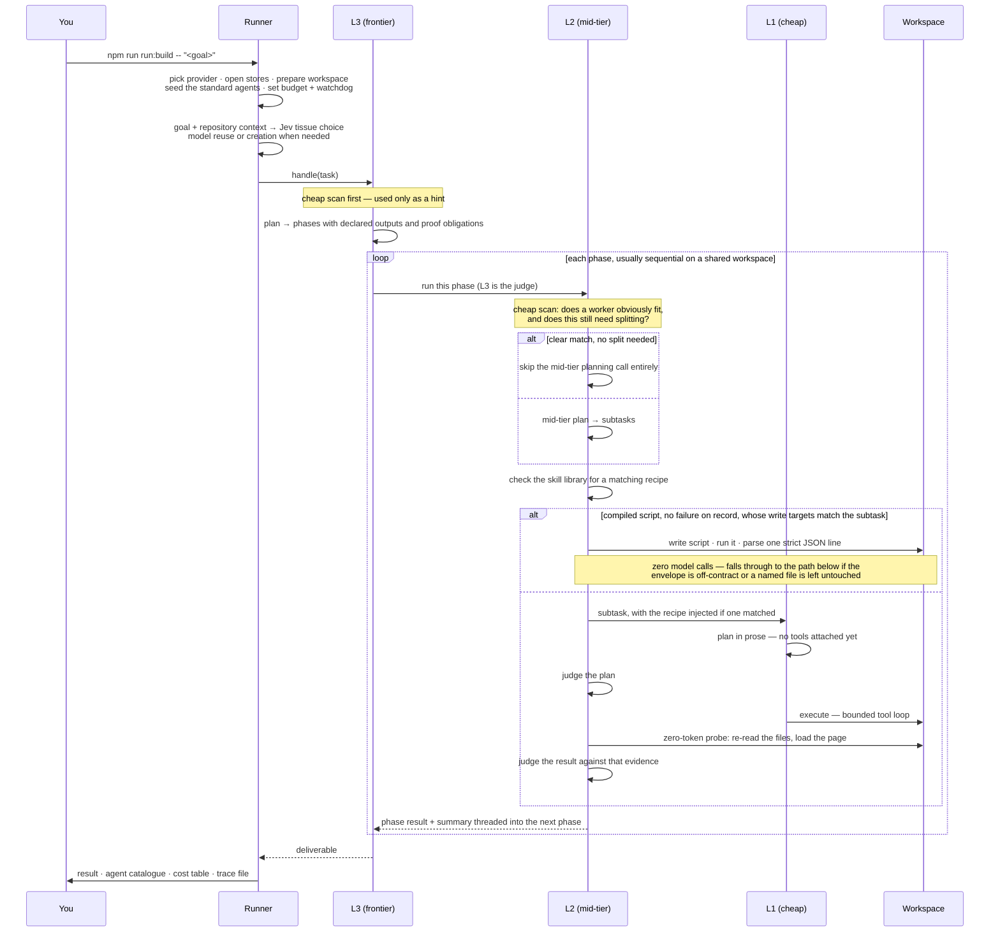
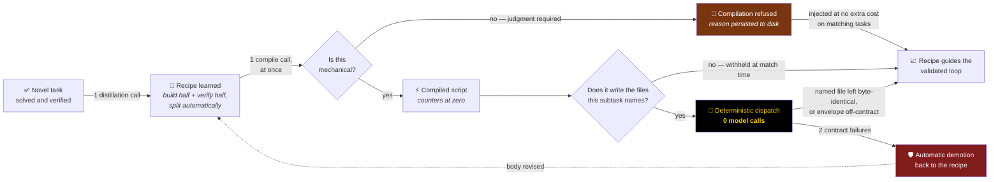
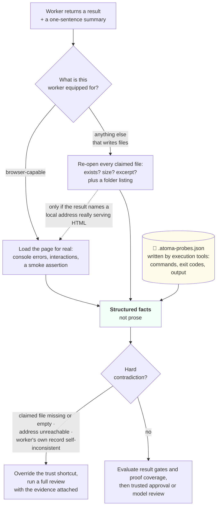
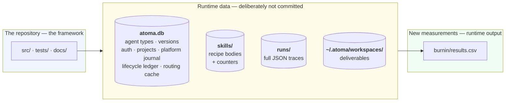

# How atoma works

*A high-level technical tour: the components, how they fit together, and what happens
during a run. Updated against the v0.4.0 source on 2026-10-01. Written for a CTO, an architect, or an engineer doing technical due
diligence — enough depth to judge the design, not enough to need the source open.*

[← back to the README](../README.md) · for the multi-tenant target state, see
[`saas-architecture.md`](saas-architecture.md) · for the engineering rationale behind
individual mechanisms, start with `AGENTS.md`; dated rationale is routed from
there to `docs/incidents/` so it is loaded only when needed.

---

## 1. The core idea

atoma models tools as atomic **elements** and arranges its LLM-backed agents in three
compositional tiers: **molecules**, **cells**, and botanical **tissues**. The agent tiers
have different responsibilities and default model tiers. **Only molecules invoke
elements on the supervised path**; provider and model pins may override the default
cost gradient.

The curated identity pools mirror expected population: 118 molecule names for the
numerous L1 workers, 40 cell names for L2, and 20 botanical tissue names for the small
L3 layer. Numeric tiers remain the stable storage and routing contract.

Since 2026-09-14, ordinary build runs enter at L2 by default. L2 supervises
L1 work without an initial L3 planning layer. If the entry cell exhausts its
supervision retries, the runner stops and archives that attempt and starts
once through L3, sharing the original deadline and accounting. Both paths
receive independent root acceptance. `--depth deep` starts directly at L3;
baseline and seeded comparisons retain their existing protocol.

Two consequences fall out of that split:

- **Tool execution is separated from supervision.** On the SUPERVISED path only the bottom tier
  is handed atoma's tool executor, so supervisors cannot mutate the workspace through the
  framework. The one application-level exception is deliberate and labelled in code: after
  supervision has failed outright, a supervisor takes over for a last-resort turn using the L1 model route.
  Codex supports all three tiers: at L1, a structured action loop sends only
  declared tool calls through Atoma's executor, with Codex's native tools
  disabled. Subscription credentials stay in host-side private profiles.
- **Every hand-off is supervised.** The link from L3 to L2 and the link from L2 to L1 run the
  *same* protocol: plan → judge the plan → execute → judge the result. It is one implementation,
  never duplicated inside the agent classes.

---

## 2. The component map

```mermaid
graph TB
    subgraph ENTRY[" 🚪 Entry points "]
        direction LR
        RUN["<b>run:build</b><br/>one goal"]
        MCP["<b>MCP over HTTP</b><br/>tiered by role<br/>start · poll · cancel · read"]
        BURN["<b>burnin</b><br/>batch measurement"]
        CURR["<b>curriculum</b><br/>propose next tasks"]
        OPS["<b>registry · skills · ledger</b><br/><b>friction · viz</b><br/>operator tooling"]
    end

    subgraph PLATFORM[" 🌐 Authenticated control plane "]
        AUTH["OAuth · organisations<br/>API tokens · personal profiles"]
        PROJECTS["Projects · run admission<br/>artifact publication"]
        GITHUB["GitHub App"]
        PREVIEW["Ephemeral previews<br/>delivered or in-flight snapshots"]
        LAUNCHER["Launcher<br/>container-engine access"]
        JOURNAL["Platform journal<br/>notifications · run limits"]
        SENTINEL["Sentinel: live, no LLM"]
        ANALYST["Analyst: ended runs, read-only"]
        MENDER["Mender: isolated fixes → PR<br/>human merge"]
    end

    subgraph RT[" ⚙️ Runtime assembly "]
        direction LR
        RUNNER["<b>Runner</b><br/><i>family-independent</i><br/>budget · signals · watchdog"]
        PROFILE["<b>TaskProfile</b><br/><i>the only per-family part</i><br/>workspace · seeds · constraints"]
        PROVIDERS["<b>Provider routing</b><br/>API · host subscription · personal login<br/>mixable per tier"]
        BACKEND["<b>Tool backend</b><br/>local operator sandbox<br/>containers for project runs"]
    end

    subgraph ORCH[" 🧠 Orchestration — one protocol at every hand-off "]
        direction LR
        L3B["<b>L3</b><br/>decompose<br/><i>frontier</i>"]
        L2B["<b>L2</b><br/>route + judge<br/><i>mid-tier</i>"]
        L1B["<b>L1</b><br/>execute<br/><i>cheap · holds the tools</i>"]
        LOOP["<b>Supervise loop</b><br/>plan → judge →<br/>execute → judge"]
        PREF["<b>Prefilter</b><br/>reuse or escalate"]
        VERD["<b>Verdict engine</b><br/>approve / reject<br/>+ scope"]
    end

    JEV["<b>TypeSafe Jev</b><br/>typed routing · intermediate approvals<br/>recipe equivalence · model fallback"]

    subgraph EXEC[" 🔒 Execution and isolation "]
        direction LR
        TOOLS["<b>10 builtin tools</b><br/>files · shell · record_probe<br/>servers · fetch · browser"]
        SANDBOX["<b>ToolSandbox</b><br/>path jail · env allowlist<br/>process-group kill"]
        CONT["<b>Container executor</b><br/>project runs · operator opt-in"]
        EGRESS["<b>Egress proxy</b><br/><i>opt-in · default-deny</i>"]
    end

    subgraph VERIFY[" 🔬 Verification — zero tokens "]
        direction LR
        PROBE["<b>Ground-truth probes</b><br/>re-read files · load the page"]
        MANIFEST["<b>Probe manifest</b><br/>machine-readable record"]
        SCAN["<b>Static script scan</b>"]
        GATE["<b>Deliverable gate</b>"]
    end

    subgraph MEM[" 🗄️ Memory — what survives a run "]
        direction LR
        REG[("<b>Agent registry</b><br/>types · versions<br/>trust counters")]
        SKILLS[("<b>Skill library</b><br/>recipes and<br/>compiled scripts")]
        LEDGER[("<b>Lifecycle ledger</b><br/>append-only<br/>audit trail")]
        PCACHE[("<b>Routing cache</b><br/><i>deliberately weak — §7</i>")]
    end

    subgraph OBS[" 📊 Observability "]
        direction LR
        METRICS["<b>Cost metering</b>"]
        TRACE["<b>Trace recorder</b>"]
        VIZ["<b>Web console</b>"]
        CSV["<b>burnin/results.csv</b>"]
        FRIC["<b>Friction report</b>"]
    end

    BURN -.->|"fresh process per task"| RUN
    MCP -.->|"starts a serialised child"| RUN
    MCP -.-> MEM
    AUTH --> PROJECTS
    PROJECTS --> RUNNER
    PROJECTS --> GITHUB
    PROJECTS --> PREVIEW
    PREVIEW --> LAUNCHER
    CONT --> LAUNCHER
    TRACE --> SENTINEL
    TRACE --> ANALYST
    ANALYST --> MENDER
    SENTINEL --> JOURNAL
    ANALYST --> JOURNAL
    MENDER --> JOURNAL
    MCP --> PROJECTS
    RUN ==> RUNNER
    RUNNER ==> L2B
    RUNNER -. deep .-> L3B
    L3B ==> L2B ==> L1B
    L1B ==> TOOLS
    L2B -.-> VERIFY
    L2B <-.-> MEM
    BACKEND -.-> EXEC
    CURR -.-> MEM
    OPS -.-> MEM
    ORCH -.-> OBS
    PREF -.-> JEV
    VERD -.-> JEV
    SKILLS -.-> JEV
    JEV -.-> TRACE

    style ORCH fill:#f5f3ff,stroke:#6b21a8
    style MEM fill:#fefce8,stroke:#a16207
    style EXEC fill:#fef2f2,stroke:#b91c1c
    style VERIFY fill:#f0fdf4,stroke:#15803d
    style OBS fill:#eff6ff,stroke:#1d4ed8
    style ENTRY fill:#f8fafc,stroke:#64748b
    style RT fill:#f8fafc,stroke:#64748b
    style L1B fill:#047857,color:#fff
    style L2B fill:#1d4ed8,color:#fff
    style L3B fill:#6b21a8,color:#fff
```

The maintained [architecture diagram](architecture.svg) covers the repository's
18 subsystems. Its component inventory is derived from the root subsystem map;
`npm run docs:check` validates the underlying IR, while SVG rendering is a separate
development step.

### The bricks, in one line each

| Layer | Component | What it does |
|---|---|---|
| **Entry** | MCP over HTTP (`/mcp`) | One catalogue tiered by role: members drive their organisation's runs; the platform admin also starts operator runs and reads registry, skills, ledger, traces, friction and the journal |
| **Control plane** | Auth and projects | OAuth identities, active organisations, API tokens, per-tier model settings, project run admission and artifact manifests |
| | GitHub App | Installation separate from login; idempotent publication of a delivered run, with retry after publication failure |
| | Preview and launcher | Classify web results, serve isolated ephemeral generations, and keep container-engine access in one subsystem |
| | Platform journal, notifications and settings | Attributable events, member notifications, platform-admin alerts and persistent run limits read at each launch |
| | Sentinel / analyst / mender | Live mechanical watch; optional read-only post-mortems; isolated correction PRs requiring human merge |
| **Runtime** | Runner | Everything family-independent: provider choice, sandbox, budget, abort signals, watchdog, trace, post-mortem |
| | TaskProfile | The *only* per-family part: workspace prep, seed agents, task constraints |
| | Provider routing | API, host subscription and personal subscription transports; each tier has its own required model selector. Codex supports all tiers through the host-side action loop |
| | Jev decider | TypeSafe's typed decision API beside the tier models: routing, eligible intermediate approvals and recipe equivalence, with model fallback |
| **Orchestration** | L3 tissues / L2 cells / L1 molecules | Decompose · route and judge · execute |
| | Supervise loop | The single plan→judge→execute→judge protocol, shared by both hand-offs |
| | Prefilter | Exact cached model fallback, then Jev when enabled, then a cheap-model scan answering "does something we already have fit this?" |
| | Verdict engine | Approve or reject, and at what scope: tweak this instance, amend the stored type, or branch a variant |
| **Memory** | Agent registry | SQLite table of agent types with full version history and trust counters |
| | Skill library | On-disk recipes and compiled scripts, with their own counters |
| | Lifecycle ledger | Append-only record of every trust change, written inside the same transaction as the change |
| | Routing cache | Memoises identical routing decisions (see §7 for why it is deliberately weak) |
| **Execution** | ToolSandbox | Path jail, credential-stripped child environment, throwaway HOME, process-group kill |
| | 10 builtin tools | Write, edit, read, list files; run a shell command; run-and-record a verification probe; start a static or Node server; fetch a URL; drive a headless browser |
| | Container executor | Required for authenticated project runs; opt-in for local operator runs. Tools run in a disposable container with only the workspace mounted and no network route by default |
| | Egress proxy | *Opt-in.* Per-run private network with a default-deny, anchored host allowlist |
| **Verification** | Ground-truth probes | Zero-token evidence gathering: re-read files, load the page, cross-check the worker's own record |
| | Probe manifest | `.atoma-probes.json` — machine-readable record of every verified invocation |
| | Static script scan | Deny-list over compiled script bodies before they are ever trusted. A hygiene filter with a known bypass — never cite it as a security control |
| | Deliverable gate | On the unsupervised path, every file the task asked for must exist — and, when the subtask used a mutating verb, must not be byte-identical afterwards. Existence alone was inert on maintenance work, where every file is seeded |
| **Observability** | Cost metering | One formula, used by both the run summary and the console, so they cannot disagree |
| | Trace recorder | Full JSON per run: every call, tool invocation, registry change and skill decision |
| | Web console | Full-GPU React client: authenticated members create projects and start runs; PixiJS replays them live, inspects learned state, and charts burn-in economics |
| | Economics ledger | `burnin/results.csv`, one row per measured run |
| | Friction report | Offline scan of stored traces for recurring tool failures — no model calls |

---

## 3. Flow — a task, end to end

The default path selects an L3 tissue from the goal and starting repository.
Jev chooses among registered capabilities; an uncertain or missing match falls
back to a bounded tier-1 call that can reuse a tissue or request a new capability.
Only the platform's pinned `ATOMA_MODEL_L3` authors a new tissue's reusable method,
using platform credentials through a separate client. The customer's model and
login never replace this platform author.
The explicit `--depth short` path enters at L2 and returns its result to the
runner's final acceptance, selecting an L3 only if it needs to deepen.

**Sequential and parallel work.** A sequential plan threads the previous phase's
summary and declared outputs into the next. `concat` and `llm-synthesize` fan out
orthogonal work in parallel; synthesis adds a model call. Shared-file mutations
belong in sequential phases. A parallel root plan with colliding declared outputs
gets one coached replan; that is advisory, not a filesystem lock. For fan-out
followed by a join, L3 sequences groups and L2 fans out within a group.

**What the plan judge does, in order** — this sequence is where most of the cost discipline
lives:

1. A **free mechanical scope check** runs before either approval shortcut. It
   can reject repeated mentions of undeclared tools once with corrective guidance;
   actual execution also enforces the worker's tool scope.
2. A **prefilter-generated routing plan** can then be auto-approved. Its
   internal marker cannot be supplied by the model. A second model verdict on
   the same bounded routing choice would add cost without new evidence.
3. A child with a clean track record is **approved with no model call**.
4. Where the approval fast path is admissible, **Jev may approve**; a refusal,
   uncertain answer or unavailable decision falls through to the cheap-model
   verdict. Jev does not write rejection guidance.

On the *result* side, trusted approval is deliberately **not blind**: the zero-token reality probe runs
first, and a hard contradiction — a claimed file missing or empty, a page that will not load —
drops the decision through to a full review. The cheapest path is not allowed to be the least
verified one.

**When it goes wrong.** Three rejections, or the same complaint three times, raises an
escalation: the child's failure counter moves (revoking trust), a variant with narrower
instructions is created and given exactly one clean attempt, and if that also fails the parent
uses the L1 model route to do the work itself — with the result explicitly stamped as fallback-produced so nobody
mistakes it for a normal delivery.

### Jev: bounded decisions beside the model tiers

Jev is TypeSafe's typed decision model, pinned in `src/core/jev.ts` to
`jev-1.13.0`. It is not a fourth agent tier or an `ATOMA_MODEL_L*` selector.
It chooses among existing agents or recipes, can approve intermediate plans
and results after the mechanical gates permit it, and checks whether a newly
learned recipe duplicates one already held. Planning, execution, rejection
guidance and root delivery acceptance remain with the existing model paths.
A Jev-only approval does not trigger recipe distillation or compilation.

`TYPESAFE_API_KEY` enables it for every run and organisation by default;
`ATOMA_JEV=0` is the global off switch. Decision state sent to TypeSafe includes
task constraints, candidate descriptions or recipe excerpts, plans/results and
bounded transport-observed evidence. Approval questions test individual
requirements; missing observations do not become proof. Ambiguous answers go
to the model. Each decision has a two-second deadline, and after three failed
decisions in a run the decider stops making further requests.

When a recipe conflicts with whether the task must change files, it is withheld
from the model's fallback catalogue. Cached fallback decisions are exact and
bound to the Jev model, thresholds, questions, candidate bodies, inputs and
selection mode; older model-only entries cannot bypass Jev. An experimental
`ATOMA_JEV_PROGRESSIVE_RECIPES=1` setting first ranks recipe groups and then
examines a shortlist within the same deadline. It is off by default and has
no measured quality advantage established by the policy change.

Each `jev` trace event records the decision, fallback or failure, latency,
usage and separate cost. A random 10% of eligible Jev approvals also receive
the ordinary model verdict in the background (`jev-audit`). This audit does
not overturn the approval; it measures disagreement with the model, which is
not independent ground truth. Pending audits may take up to 60 seconds to
settle when a run finishes.

Platform administrators can use `atoma_jev_calibrate` to compare questions and
thresholds against recorded model decisions. `auditsOnly: true` reads the
existing audit sample and bounded cost/outcome report without a TypeSafe call;
ordinary calibration sends recorded decision context and incurs TypeSafe cost.
See the [decision record](jev-decisions-2026-09-28.md),
[October policy corrections](jev-policy-2026-10-01.md) and
[service terms](platform-commons-terms.md#decisions-taken-by-typesafe).

---

## 4. Flow — how a repeatable phase gets compiled away

Historical evidence, not a current-release performance claim: across the first eight
controlled rounds the compiled path fired 14 times, 11 of them in a single round whose
deliverables turned out wrong. The lifecycle below has guarded promotion and dispatch; what is
missing is demand for it on the task families measured so far. See
[`hybrid-skills-design.md`](archive/experiments/hybrid-skills-design.md) for the most recent attempt to change
that — designed, measured and refused.

**Compile at learn, dispatch at first match** (owner decision, 2026-09-26 —
[`compile-at-learn-2026-09-26.md`](compile-at-learn-2026-09-26.md)). A recipe that can be
compiled is compiled the moment it is learned, from the run it was distilled from, on every run
— seeded or from scratch. The script it produces dispatches on its first match, with no clean
runs required first. Until that date, promotion had to be earned twice: three credited runs for
the recipe, then three validated runs for the script, whose counters are reset at compile time.
That wait bought one thing — no compile, and no unwatched run, until the recipe had been
observed working — and the threshold experiment of 2026-08-07 had already shown it never changed
the compiler's verdict. What guards a fresh script now is mechanical: the output envelope, the
before/after check on the named files, the anti-redispatch memo, and demotion after two
contract failures back to the recipe every compiled script keeps as its fallback. A script
without that fallback — a hand-authored one — never dispatches directly. None of them judges
content. A wrong script that exits cleanly and changes the right files is accepted, and it
stays trusted until a failure is recorded against it. The binding constraint is unchanged: a
script runs free only *when it is matched to work it can actually do* — in round 8 a fully
trusted, correct compiled script was withheld 14 times, every refusal justified, and dispatched
zero times.

**Promotion is on by default for every run.** `ATOMA_SKILL_PROMOTE=1` is the explicit opt-in,
any other explicit value turns it off, and `--no-promote-skills` is the final veto. Recipes live
under the owning molecule's id, and skill credit requires evidence that the recipe drove the
attempt. Plans declare `outputs`; compilation declares `writes`. Those structured fields are
checked before dispatch, with lexical matching retained for legacy records.

**Splitting build from verify is what makes anything compilable at all.** A monolithic
"build and check it" recipe always gets refused, because the build half is irreducible
reasoning. Distilling the verification half separately is where most compiled scripts come from —
the measured catalogue produced most of its script forms this way. The remaining script forms
came from authoring recipes whose output was fully determined by the workspace, such as assembling
package metadata and documentation for an already-tested CLI.

**Field-proven, unattended — with a caveat about the evidence.** When a workspace's module
semantics broke a compiled verifier, the entire safety stack ran by itself across two runs —
dispatch, contract failure, failure streak, demotion to the recipe, an anti-recompile stamp with
the reason recorded — and every run still shipped via the supervised path while the system
quarantined its own broken optimisation. This is historical evidence: the batch's CSV and traces are archived outside the
checkout. The account survives in the archived engineering record linked from
[`AGENTS.md`](../AGENTS.md); it is not reproducible from a committed
`burnin/results.csv`.

---

## 5. Flow — how a result is proven

The supervisor gathers evidence with tools it owns rather than trusting the
worker's account. It never re-runs model-authored shell commands. The bounded
exception for inherited browser checks is described below.

Three design decisions worth flagging:

- **The probe costs zero tokens.** It is local file reads, or one page load. That is why it can
  afford to run on the most-trusted path.
- **Ground-truth heuristics supply facts for review.** They can remove the trust
  shortcut, but do not reject alone. Separate declared-failure gates reject directly;
  disk-evidence gates reject once per task and send byte-identical repeats to the
  model reviewer. These dispositions live in one result-gate table.
- **Command replay was considered and rejected.** Re-running command strings the worker wrote
  would mean parsing model-authored shell out of prose, and execution is not idempotent — the
  verification could mutate the thing it verifies. Instead the *evidence format* was raised: the
  execution tools record observations in a machine-readable file, and the supervisor reads and
  cross-checks it. A compiled verifier may consume that manifest as L1 execution;
  that does not give supervisors permission to replay arbitrary shell commands.

**The manifest is the machine interface.** Its schemas, the instructions given to writers, the
instructions given to replaying scripts, and its health check are all generated from one module
whose examples are validated against the schemas at load time — so the four sides cannot drift
apart. That structure exists because the hand-written era produced two production incidents where
they did.

**The manifest is not the only evidence.** `record_probe`, `fetch_url` recording
and `validate_html` write structured observations; a manifest on disk remains
workspace data. Transport-observed attestations are held by the supervisor,
outside the worker's writable evidence. Declared proof obligations inherit through
plans. Missing coverage forces full review and, even when the artifact is approved,
withholds L2's child trust credit, skill credit, distillation and promotion. An
observation bound to a document whose digest changed is stale. Acceptance of a
result and permission to learn from its method are separate decisions.

**Existing static pages carry regression checks forward.** Before the first
worker tool call, the host replays inherited browser checks twice on the
untouched seed. Checks that pass both times are tested again at delivery;
repeatable failures go to root acceptance to decide whether the user asked
for the change. Unrequested regressions block delivery and feed remediation.
After remediation, an incomplete recheck cannot silently clear the earlier
refusal. Missing hooks are marked and only pruned on a later qualifying run,
alongside a passing check of the same page. This is bounded browser replay,
not general command replay; its observations earn no checklist or learning
credit. See [the replay contract](inherited-checks-replay-2026-10-01.md).

**Verification phases preserve the deliverable.** A read-only phase snapshots
the workspace and restores changes made by file tools or shell commands, with
explicit exceptions for live databases and files being written by another
process. Workers must read existing files before changing them, and final
review receives the starting-file evidence. A seeded deepening preserves the
original seed and probe manifest rather than starting from an empty workspace.

---

## 6. Where state lives

**One primary product database, with operational exceptions.** Agent types, their
version history, the lifecycle ledger, routing cache, auth, projects, platform
journal and run-limit overrides use the primary SQLite store. This consolidation is deliberate:
when the ledger was a sibling file, a counter and its audit event could be written in separate
steps, so an ill-timed crash left the integrity checker reporting a state that could not
otherwise occur. They now share a transaction.

**Recipes stay on disk, and that is a decision rather than an omission.** `SKILL.md` is the
portable interchange format — it can be read, grepped, hand-edited and exported to other agent
tooling verbatim. Sidecars carry skill counters and provenance. Project workspaces and traces
live below `orgs/<orgId>/projects/<projectId>/`; the registry and the skills
catalog are the platform's, one of each, and every run — the operator's or an
organisation's — reads them and earns trust on them alike
([`platform-trust-2026-09-15.md`](platform-trust-2026-09-15.md)).

The machine-global MCP run lease uses `~/.atoma/mcp-run-lock.db`; private subscription
profiles and their locks have their own operational storage. Supervisor verdicts
and mend records live under `ATOMA_SUPERVISOR_DIR`. None belongs in a release
archive. Back up persistent state before replacing it; do not wipe a store or
trace corpus to reproduce a benchmark.

**A fresh clone starts at zero.** The trained state is data, not source. That is what makes the
cost curve a *measurement* — new runs can measure learning from empty state. Older measurements were
archived at the 2026-08-18 reset; a fresh run does not regenerate their exact rows.

---

## 7. The safety model — what is actually enforced

Stated plainly, because the distinction between default and opt-in matters.

**Enforced by default, locally:**

| Control | What it means |
|---|---|
| Path jail | File tools cannot escape the workspace — checked both by path arithmetic *and* by following symlinks to their real destination |
| Credential stripping | Spawned processes get an allowlisted environment and a throwaway HOME. The run's own API key is physically absent from anything the model starts |
| Process-group kill | Every server or browser started is reaped on any exit path, including a crash |
| Tool-scope enforcement | A tool the worker was not granted is refused by the transport and reported back inline — never executed |
| Output truncation | Oversized tool output is trimmed before being re-charged to the model on the next round |

**The honest limit.** In local mode the shell child is *not* jailed — it is started with the
workspace as its working directory and nothing more, so an absolute path reaches the rest of the
machine. The shell executable list is **steering, not a boundary**: `bash`, `node -e` and
`python3 -c` are all on it and each is a complete escape hatch. This is stated in the code and in
the engineering record linked from `AGENTS.md` rather than papered over.

**Opt-in, and this is what actually closes that gap:**

- `--container` runs every tool inside a disposable container with only the workspace mounted, no
  network route, all privileges dropped, and memory and CPU ceilings. The registry, the recipes
  and other runs' traces are simply *absent from that filesystem* — the path walk that works
  locally finds nothing. The container keeps its own loopback, so starting a server and probing
  it still works. Measured overhead: **~4ms per tool call, ~243ms container boot** — recorded
  in the archive linked from `AGENTS.md`
  from one session of three cold starts; no committed artefact regenerates it.
- `--egress` adds a per-run private network and a gate process with a default-deny, anchored host
  allowlist — raw IP addresses always refused, lookalike hosts refused by construction. It
  requires Docker Engine 28+: both bridge gateway modes are `isolated`, removing the host-side
  gateway addresses that a plain `--internal` network would still expose.

Container isolation is optional on the local operator path. Model-authored shell
commands still pose a risk to that operator's host. Authenticated project runs
use containers with outbound networking disabled. Preview policies are configured
separately; the login gate alone does not turn the local shell into a tenant boundary.

**Preview is a separate boundary.** Supported delivered results and in-flight
snapshots run as ephemeral generations, never in the mutable live workspace.
Static previews need no application container; Node previews use a runtime image,
a read-only root and, in production, gVisor. Origins use a separate registrable
domain, short-lived claims and credential filtering. Runtime egress is denied by
default; an organisation admin can approve hosts requested by a delivered project.
In-flight previews receive no egress. See [preview deployment](preview-deployment.md).

**One weak mechanism, documented as weak.** The routing cache memoises identical routing
decisions. Measured over 748 real calls, only 13 were repeats — a **1.7% ceiling**, worth
$0.0003 per run. It is kept because it is cheap and honest about itself, and the code carries an
explicit warning against the obvious "fix": fuzzy matching would raise the hit rate by trading
the cache's only safety property — exactness — at the one point in the pipeline with no validator
above it.

---

## 8. Where the money goes

Typical roles in the measured normal path; counts are not hard limits or current benchmarks:

| Slot | Model tier | Typical count | Note |
|---|---|---|---|
| Top-level plan | frontier | **1 on the deep path** | Default short runs enter at L2; deep runs and deepening add L3 strategy. Replanning or synthesis can add calls |
| Routing scans | Jev, then cheap-model fallback | Varies by phase and reuse | Exact cache hits and decisive Jev answers avoid the model scan |
| Mid-tier plans | mid | **0 on the happy path** | Skipped entirely when the routing scan finds a clear match |
| Reviews | Jev or cheap model | Varies with trust, gates and audits | Mechanical probes remain; root acceptance stays independent of Jev |
| Execution | cheap | the bulk of tokens | Long tool loops; prompt caching is monitored live in every run summary |
| Compiled phases | — | **0 calls**, but rare | Two tool calls and a strict JSON parse. Present in 45 of 156 corpus runs; across the historical controlled-run rows it fired once in 54 build runs and 13 times in 30 maintenance runs |

**Prompt caching is load-bearing and monitored.** The system-level prompt is deliberately long
enough to clear the provider's minimum cacheable size; trimming it below that threshold silently
disables caching with no error. The cache-read column in the run summary is the operator's live
check that it is still working.

**Jev has its own accounting.** Its usage and estimated cost live on `jev`
events, outside the run's LLM totals and LLM token/spend ceilings. Sampled
model audits are LLM calls and do count there. Include both when comparing
whole-run cost; a model-only total is not the whole bill when Jev is active.
The calibration report's savings estimates use same-run model samples and
remain unknown when no reference sample exists.

**Platform limits are read per run.** Administrators can persist defaults and
ceilings through Settings or `npm run settings`, without restarting the server.
Explicit launch requests override defaults but cannot exceed a binding ceiling.
Token or LLM spend ceilings abort further calls and retain completed work as a
partial run. See [the operating guide](automatic-deployment.md#run-limits-without-a-redeployment).

---

## 9. What is not built

Recorded so nobody has to discover it in a demo:

- **No full multi-tenancy.** The web console is open on loopback by default and has an optional
  multi-organisation login gate. A first login creates a personal organisation unless it redeems
  an invitation; a principal may join several organisations and choose an active one.
  Authenticated projects, their run workspaces and traces are scoped to that
  organisation, while a platform admin can read across organisations. The agent registry,
  the skills catalog, their trust counters and the lifecycle ledger are ONE per platform by
  decision (a run is a run), so this is not a deployment shape for mutually untrusted
  organisations; see the dated boundary in
  [`saas-architecture.md`](saas-architecture.md).
- **Self-hosting requires operator setup.** The repository includes a compiled
  deployment workflow and host templates, but deploying requires a configured host,
  identity providers and credentials. See [automatic deployment](automatic-deployment.md).
- **The browser-based family cannot reach zero cost yet.** Compiled scripts have no browser, so
  the compiler correctly refuses to compile web-validation recipes. In the historical measured
  catalogue, compiled scripts belonged to the command-line and documentation bucket; those observations do not establish the contents of a fresh or privately trained store.
- **Partial replay does not exist.** When a multi-phase plan is rejected, the whole plan re-runs;
  there is no mechanism to keep the good phases and redo only the bad one.
- **No OpenTelemetry export or external dashboard integration.** The console follows
  runs live and optional web push reports meaningful events. Those features do not
  imply a public model-token streaming API.
- **No autonomous merge of repairs.** The sentinel observes live without an LLM.
  The optional analyst inspects finished runs read-only; the mender consumes eligible
  cited defects, checks an isolated change and opens a PR. A person merges it.
  Analyst and mender reserve the shared run lease while working and cleaning up,
  so a product run cannot start beside them. See the
  [supervisor deployment guide](supervisor-codex-production.md).

---

## 10. Reading further

| Question | Where |
|---|---|
| Why does mechanism X exist? | `AGENTS.md` for the active contract, then its linked engineering-record entry |
| Where does Jev decide, and how is it evaluated? | [Decision record](jev-decisions-2026-09-28.md) · [Policy and evidence corrections](jev-policy-2026-10-01.md) |
| What was tried and rejected? | `docs/incidents/engineering-record-2026-08-14.md` § *Considered and rejected* |
| What would a hosted deployment require? | [`saas-architecture.md`](saas-architecture.md) Layer 2 invariants and Layer 3 remaining work (W1–W14) |
| What does a real run look like? | `npm run viz` for existing traces; `npm run viz:demo` writes a mocked run, and `npm run preview:demo` opens a seeded authenticated preview without paid inference |
| How does another agent drive atoma? | Claude Code: `claude mcp add atoma --transport http <origin>/mcp --header "Authorization: Bearer <token>"`. Codex CLI: an `[mcp_servers.atoma]` table in `~/.codex/config.toml` with `url` and `bearer_token_env_var = "ATOMA_MCP_TOKEN"`. One MCP, the tools your role admits, plus a goal-template prompt per task family at the platform tier |
| Are the economics real? | `npm run burnin` measures a new corpus using model quota; historical CSVs were archived at the 2026-08-18 reset |
| …under a control? | `benchmark/PROTOCOL.md` — every round registered before it ran — and `benchmark/ROUND8.md` |
| Do the deliverables actually work? | `benchmark/results-round8-scores.json` is the committed historical 7-check output; `verify-maint.mjs` now has 10 checks, but the round workspaces needed to regenerate it are not committed. Rounds 4-7 have no committed scorer output |
