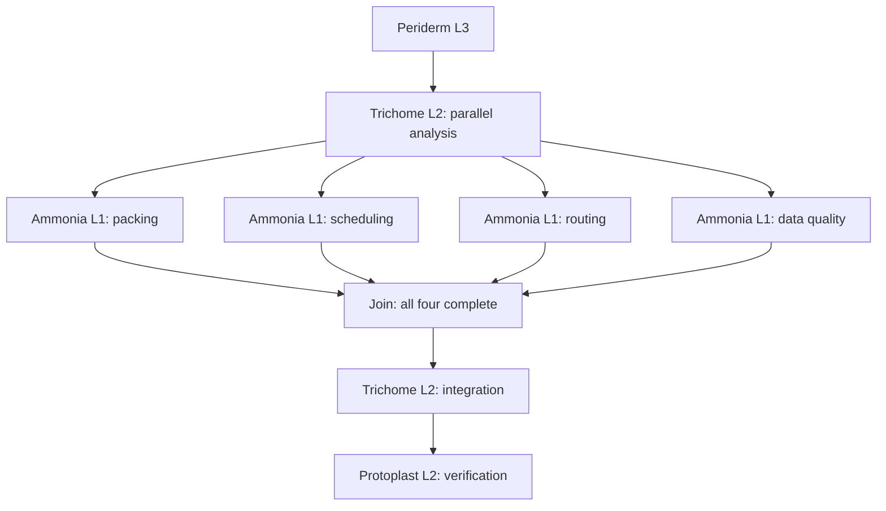

# Four parallel analyses, a joined dossier, and a publication gap — 2026-10-03

One production run delivered correct finite optimization and data-quality results
through four overlapping branches. Integration waited for every branch. The
published package nevertheless fails its own requested inventory contract: its
model-authored manifest includes an internal probe sidecar that publication
intentionally excludes. The delivered verifier passes without noticing this.
This is a successful parallel-execution experiment, not full acceptance of the
delivered package.

Follow-up: [two targeted repair runs](parallel-mission-repair-2026-10-03.md)
corrected the generated inventory and verifier; independent checks pass on
publication `7ea13916145f83ad54319ac8428e38a316333d79`. The original evidence below
is retained unchanged.

## Reproducible evidence

- Source/deployed revision: `543db6d611078c218d8acf0dc3881f56ea1333ce`.
- Project: `e5431908-38f6-4d1e-b30a-ea2122c052cd`,
  `parallel-mission-20261003` (Field observatory — parallel mission dossier).
- Run: `8738f263-a6b6-4084-897e-a57fc2ea4786`.
- [Published repository](https://github.com/mgtf/atoma-parallel-mission-20261003/tree/e928a44ad9dac3fbd9fbbdd7fae5bbacd45df98a),
  commit `e928a44ad9dac3fbd9fbbdd7fae5bbacd45df98a`.
- [Preregistered prompt, criteria, and expected results](evidence-parallel-mission-2026-10-03/preregistration.json).
- [Complete trace: 205 events and metadata](evidence-parallel-mission-2026-10-03/run.json),
  [terminal project/run receipt](evidence-parallel-mission-2026-10-03/status.json),
  [verification receipts](evidence-parallel-mission-2026-10-03/checks.json).

Production investigation used the admin MCP, paged through the complete trace,
and then read the published Git bytes. An MCP start-call timeout did not cancel
the run: observation resumed against the same run ID without another launch.
No platform source changed during this experiment. Independent expected values
were computed outside the run and were not disclosed in its prompt.

The task asked for a fictional observatory mission dossier using Python standard
library, JSON, CSV, and Markdown: four separate analyses, disjoint directories,
then integration, mutation tests, and a SHA-256 inventory. No website, external
data, or packages were required.

## Selection and observed execution

The platform tissue author used the platform L3 pin, `sub:openai:gpt-5.6-sol`,
and created **Periderm** for this goal. The other pins were
`sub:openai:gpt-5.6-terra` at L2 and `sub:openai:gpt-5.6-luna` at L1.



These are four distinct L1 execution branches of the same registered molecule,
under one L2, not four newly created L2s. The L3 uses sequential phases around
that parallel group, consistent with the one-aggregation-mode-per-plan contract.

Offsets below are seconds after the first trace event. Branch start/end records
and tagged LLM/tool events establish overlap; the plan wording alone does not.

| Workstream | Branch start | Branch end | LLM calls tagged to branch | Tool calls tagged to branch |
| --- | ---: | ---: | ---: | ---: |
| Packing | 146.679 | 618.488 | 2 | 17 |
| Scheduling | 146.495 | 397.288 | 2 | 11 |
| Routing | 139.937 | 597.383 | 3 | 17 |
| Data quality | 139.982 | 469.123 | 2 | 12 |

All four branches overlapped for **250.609 seconds**. Integration started at
618.521, after the last child ended at 618.488. This proves the join barrier was
respected. It does not establish a causal speedup: there is no sequential control
arm, and provider queueing, caches, and shared learned skills are uncontrolled.

The project run's start-to-end interval was **1,191.297 seconds (19m51.297s)**;
the inner trace records 1,181.796 seconds. Publication contains **21 files,
102,940 bytes**. Accounting reports 29 LLM calls and $0.7621 subscription cost;
that figure is accounting, not a separate API invoice. Two reported refusals
are skill-compilation promotion refusals, not failed task branches. One new
skill, `integrate-verified-workstreams`, was learned.

## Independently checked results

| Stream | Result | Independent check |
| --- | --- | --- |
| Packing | Value 39, weight 19; X contains A/E, Y contains B/G/H/I | Enumerate all 3^9 assignments; verify mandatory items, separation, capacity and both objective priorities |
| Scheduling | Baseline makespan 8; bench disruption makespan 10 | Separate finite search plus direct witness checks, including release time, precedence, bench availability and shared technician |
| Routing | Baseline 19; removed RS edge 25 | Separate shortest paths/order enumeration plus actual edge-by-edge walk checks |
| Data quality | Five retained rows; S1 mean 4, S2 mean 12, S3 mean 0.5 | Compare retained rows, exclusions and aggregates against independently derived reference |

The published `verify_all.py` was inspected before execution. It passes the four
stream checks, rejects one deliberately corrupted result per stream in temporary
copies, and preserves original stream files byte-for-byte. Those tests check
specified corruption examples; they do not prove rejection of every possible
wrong output. The independent checker also passes on the exact published commit.

## Recovered errors and outstanding gaps

1. The data-quality branch initially wrote an invalid f-string and hit a Python
   syntax error (`6e3bd03c-3802-4611-9376-7e289ffb68d8`). It repaired the file and
   executed successfully (`243281e4-47c4-492b-8266-42cb101041d0`).
2. Integration initially treated the routing input's edge list as a dictionary
   (`0fddd0d1-9d2f-46d0-b199-cd9847942cb9`). It corrected that interface mismatch
   and reran the global verifier successfully
   (`0fb3e9e0-7a7c-4e16-95cf-6394fdb453fc`). Expected negative-test exits are
   separate from these recovered implementation errors.
3. **The published package manifest is inconsistent.** It lists 21 entries:
   the 20 delivered files other than itself, plus `.atoma-probes.json`. All 20
   existing hashes match; the internal sidecar is absent. The platform's own
   artifact manifest correctly describes the 21 published files. The defect is
   in the model-authored deliverable inventory and its acceptance across the
   publication boundary, not evidence that internal sidecars should be exposed.
   `verify_all.py` never checks this manifest and therefore reports success.
4. **Inputs are only partly declarative.** Quality calibration formulas and the
   accepted band are in solver code, and the routing disruption selects RS in
   code. The fixed requested cases reproduce correctly, but their `input.json`
   files do not preserve every source assumption independently of implementation.
5. **Final verification has narrower evidence than its label suggests.**
   Protoplast selects the existing `recheck-recorded-command-probes` skill and
   the deterministic execution returns 17 replay receipts. Replaying author
   probes does not independently establish all optima or inspect the eventual
   published manifest. The final result output is primarily these receipts;
   the human-readable results and limitations live in `dossier.md` and README,
   rather than the requested concise final answer.

The run reports `delivered`, zero uncovered obligations and zero root
remediations. That status must not hide the observed publication-contract gap.
Before the next unrelated live batch, address and regression-test the boundary
between generated inventories and the actual published file set. Preserve the
internal-sidecar exclusion. Do not weaken the requested inventory criterion to
make this run pass.

## Replay the independent checks

Check out the published commit with Git newline conversion disabled to preserve
SHA-256 identity. From the Atoma repository root, substitute that checkout path:

```text
python docs/incidents/evidence-parallel-mission-2026-10-03/check-results.py <checkout>
python docs/incidents/evidence-parallel-mission-2026-10-03/check-overlap.py
python docs/incidents/evidence-parallel-mission-2026-10-03/check-package.py <checkout>
```

The first two exit zero. The third intentionally exits one on this publication
and identifies the missing sidecar; its nonzero exit is the reproducible defect.
The [oracle](evidence-parallel-mission-2026-10-03/oracle.py) and checker sources
are preserved beside the full trace. The delivered verifier was run separately
after inspecting all five Python scripts; its successful output is also in the
verification receipts, alongside the failing independent manifest check.
